# MyPersona: zk-KYC Network 🛡️🇮🇳

[](https://rbi.org.in)
[](https://amoy.polygonscan.com/)
[](./LICENSE)

> **"Reusable, gas-less privacy tokens using Zero Knowledge Proofs with embedded, pausable regulatory oversight for India."**

---

## 📖 Executive Summary

**MyPersona (zk-KYC)** is a decentralized, privacy-first identity framework designed to solve the **"Tokenised KYC"** challenge.

We are moving India from a fragmented, insecure identity model to a unified, private one.

![The Problem vs. The Solution]


In the current financial ecosystem, users must repeatedly share sensitive documents (Aadhaar, PAN) with every new service, creating redundant data silos and "Honey Pots" for hackers. MyPersona replaces this with a **Self-Sovereign Identity (SSI)** model.

We enable users to convert their KYC into **reusable, tamper-proof digital tokens** stored on their mobile devices. Using **Zero-Knowledge Proofs (ZKPs)**, users can prove eligibility without revealing their underlying data.

---

## 🚀 Key Features

| Feature | Description |
| :--- | :--- |
| **🔐 Zero-Knowledge Privacy** | Users prove facts (Age, Income) without sharing raw documents. Data never leaves the user's phone. |
| **💸 Truly Gas-less UX** | Built on a **Meta-Transaction Relayer**. Users perform verifications without owning crypto or paying gas fees. |
| **🚦 Regulatory Kill-Switch** | Smart contracts feature a **`Pausable`** module, allowing the RBI/Admin to freeze the system instantly during security threats. |
| **🔄 Interoperable** | Built on **W3C Verifiable Credentials (VCs)**. Compatible with existing standards like DigiLocker and CKYCR. |
| **📱 Offline-Ready** | Proof generation happens locally on the device using lightweight **Circom** circuits (Groth16). |

---

## 🧠 How it Works: The ZKP Magic

The core of our solution is the Zero-Knowledge Proof. It allows a user to prove a claim to a service provider (Verifier) without revealing the data behind that claim.


As shown above, the user's phone generates a cryptographic proof locally. The Verifier (e.g., a Mutual Fund App) receives only a "Yes/No" answer, ensuring absolute privacy.

---

## 🏗️ Architecture & Workflow

The solution operates on a trust triangle between the **Issuer** (Bank), **Holder** (User), and **Verifier** (Service Provider), with the blockchain acting as the immutable trust layer.

```mermaid
sequenceDiagram
    participant I as 🏛️ Issuer (Bank)
    participant U as 📱 Holder (User App)
    participant V as 🏢 Verifier (Mutual Fund)
    participant B as ⛓️ Polygon Blockchain

    Note over I, U: Phase 1: Issuance (One-Time)
    I->>U: Verifies Docs & Issues Signed VC (Token)
    U->>U: Stores VC in Encrypted Vault

    Note over U, V: Phase 2: Presentation
    V->>U: Requests Proof: "Are you > 18?"
    U->>U: Generates ZK-Proof Locally (Circom + SnarkJS)
    U->>V: Sends {Proof, Public Signals, Credential Status ID}

    Note over V, B: Phase 3: Verification (Dual-Check)
    V->>V: 1. Cryptographic Check: snarkjs.verify(proof) [OFF-CHAIN]
    V->>B: 2. State Check: Read IssuerRegistry (Is Issuer trusted?)
    V->>B: 3. State Check: Read RevocationRegistry (Is VC revoked?)
    B-->>V: Returns: ✅ Issuer Valid, Not Revoked
    V->>U: ✅ Instant Onboarding 🚀
```




### Workflow Breakdown

**Phase 1: Issuance (One-Time Setup)**
- A trusted authority (Bank/CKYCR) verifies the user's documents
- Issues a digitally signed Verifiable Credential (VC)
- User stores this VC in their encrypted mobile wallet

**Phase 2: Presentation (When Needed)**
- Service provider requests a proof (e.g., "Are you over 18?")
- User's wallet generates a Zero-Knowledge Proof locally
- Only the proof is sent—no personal data leaves the device

**Phase 3: Verification (Instant)**
- Verifier checks the blockchain to confirm:
  - Is the issuer valid? (IssuerRegistry)
  - Is the credential revoked? (RevocationRegistry)
- Access granted within seconds

---

## 📱 User Experience (Gas-less & Simple)

A key barrier to blockchain adoption is complexity. We have abstracted away all crypto-related friction. The user experience is designed to be as simple as a standard UPI app.

The user simply presses a button to generate a proof. There are no gas fees and no complex wallet interactions.

---

## 📂 Repository Structure

This monorepo contains the end-to-end implementation of the MyPersona infrastructure:

### 1. `/kyc-contracts` ⛓️
The on-chain trust layer deployed on Polygon Amoy.

- **IssuerRegistry.sol**: Whitelist of authorized banks/CKYCR nodes.
- **RevocationRegistry.sol**: Handles real-time credential revocation (e.g., lost devices).

**Tech Stack**: Solidity, Hardhat, OpenZeppelin.

### 2. `/issuer-portal` 🏛️
The admin dashboard for banks/regulators.

- Allows institutions to perform KYC and mint Verifiable Credentials to users.
- Manages the "Emergency Freeze" and Revocation controls.

**Tech Stack**: Node.js, React, Ethers.js.

### 3. `/user-app` 📱
The consumer-facing mobile wallet.

- Stores credentials securely using AES-256 encryption.
- Contains the local ZKP Generator (Circom/SnarkJS) to create proofs offline.

**Tech Stack**: React Native, SnarkJS.

### 4. `/verifier-service` 🏢
The integration service for Fintechs (e.g., Insurance/Lending apps).

- Generates QR codes for proof requests.
- Verifies incoming ZK-Proofs against the blockchain.

**Tech Stack**: Node.js, Express, Polygon ID SDK.

---

## ⚡ Getting Started

### Prerequisites
- Node.js v18+
- Yarn / NPM
- An Android/iOS Emulator (for the User App)

### Installation

**1. Clone the Repository**

```bash
git clone https://github.com/psr-codes/MyPersona.git
cd MyPersona
```

**2. Setup Contracts**

```bash
cd kyc-contracts
npm install
npx hardhat test  # Run security tests
```

**3. Run the Issuer Portal**

```bash
cd ../issuer-portal
npm install
npm start
```

**4. Run the Mobile Wallet**

```bash
cd ../user-app
npm install
npx react-native run-android
```

---

## 🛡️ Security & Compliance

- **PMLA Compliance**: We adhere to the Data Minimization principles of the DPDP Act 2023.
- **Audit Trail**: The RevocationRegistry maintains an immutable log of credential validity without storing PII on-chain.
- **Encryption**: All local data is encrypted at rest; all transport is secured via DIDComm/TLS.

---

## 👥 The Team

We are a team of final-year undergraduates from **NSUT (Netaji Subhas University of Technology)** with a focus on Applied Cryptography and Fintech.

- **Pulkit Pathak** - Lead Blockchain Architect
- **Prakash Singh Rawat** - Zero-Knowledge Cryptography Lead
- **Mohd. Dilshad** - Full Stack & Product Engineer

---

## 📄 License

This project is licensed under the MIT License - see the [LICENSE](./LICENSE) file for details.

---

## 🙏 Acknowledgments

Built with ❤️ for **RBI HaRBInger 2025**

Special thanks to the Reserve Bank of India for creating this innovation challenge to advance India's digital identity infrastructure.

---

## 📞 Contact

For queries, collaborations, or feedback:
- **GitHub**: [psr-codes/MyPersona](https://github.com/psr-codes/MyPersona)
- **Email**: pulkitpathak.knp@gmail.com

---

**MyPersona** • Redefining Digital Identity for a Billion Indians 🇮🇳

``` mermaid
template AgeCheck() {
    signal input dateOfBirth;  // Private (never revealed)
    signal input currentDate;  // Public
    signal input minimumAge;   // Public
    
    signal output isValid;     // Public (1 or 0)
    
    component ageCalculator = CalculateAge();
    ageCalculator.dob <== dateOfBirth;
    ageCalculator.today <== currentDate;
    
    component comparator = GreaterEqThan(8);
    comparator.in[0] <== ageCalculator.age;
    comparator.in[1] <== minimumAge;
    
    isValid <== comparator.out;
}
```
